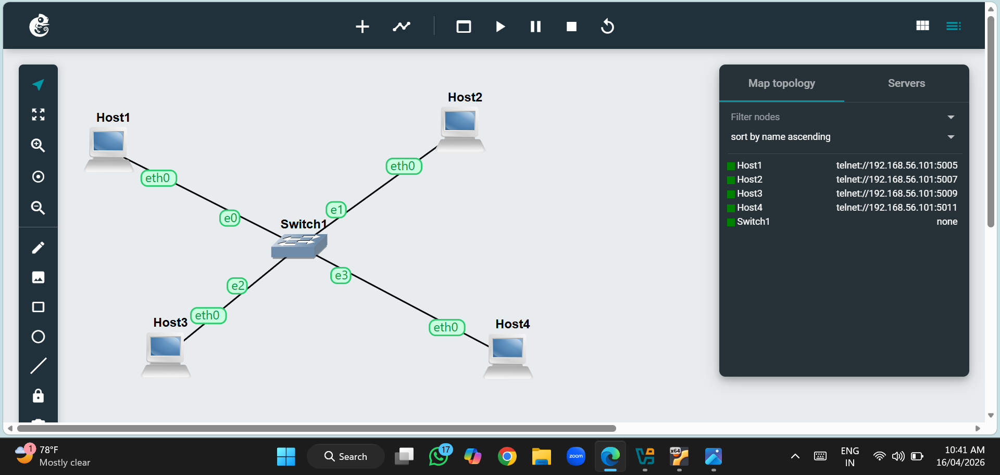
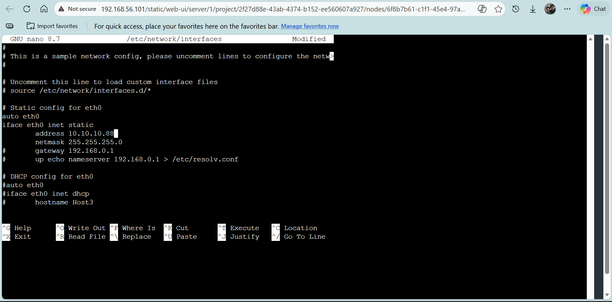
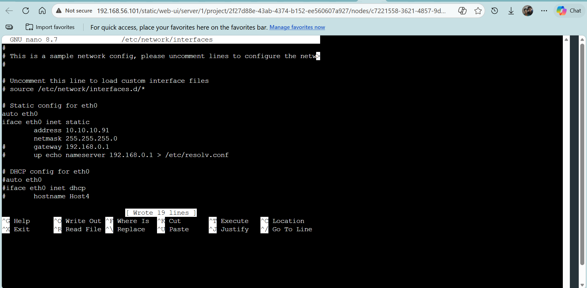
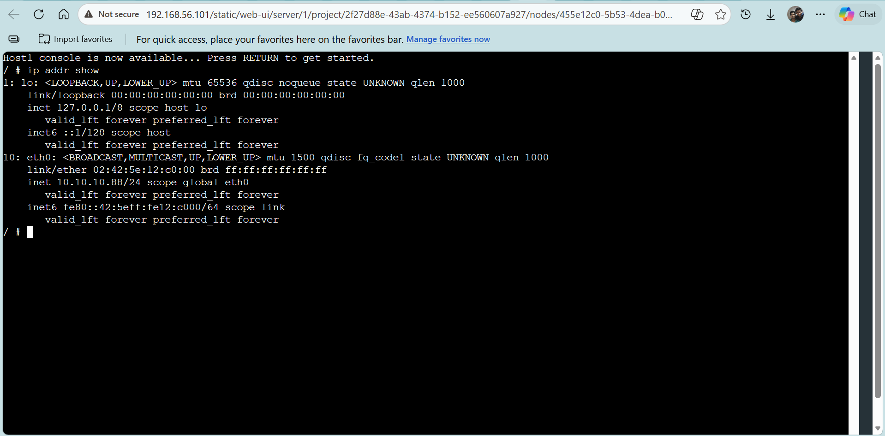
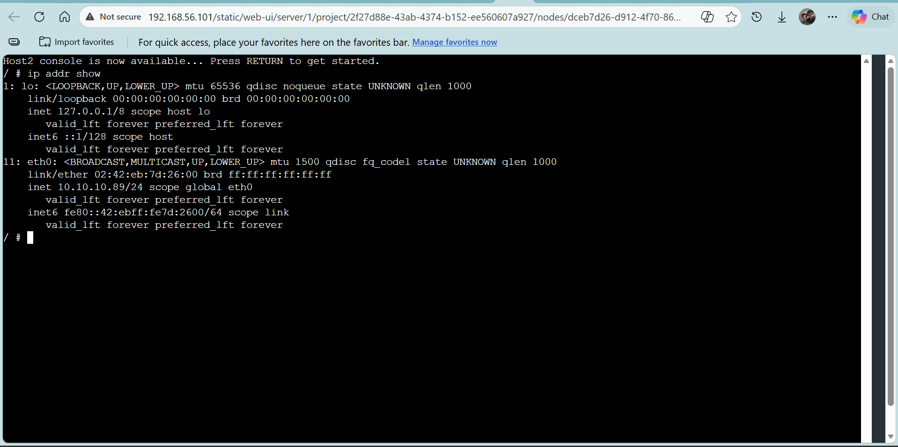
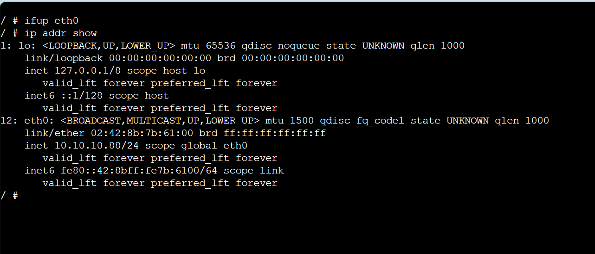
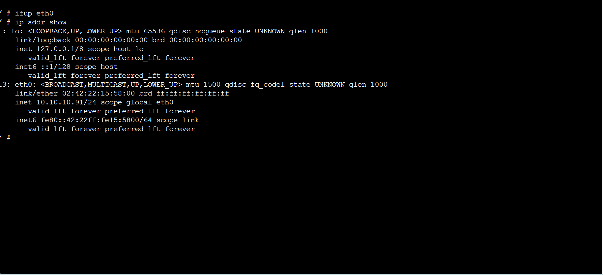
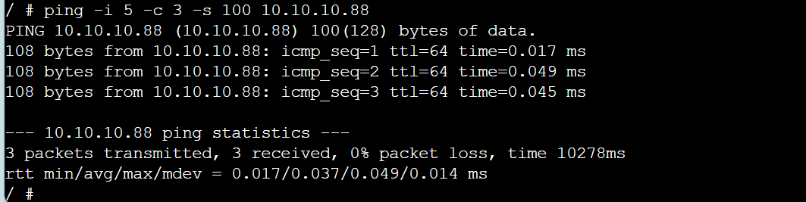
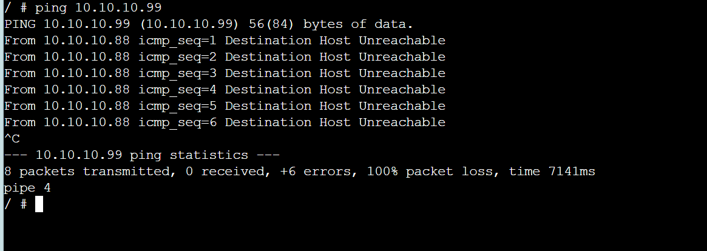
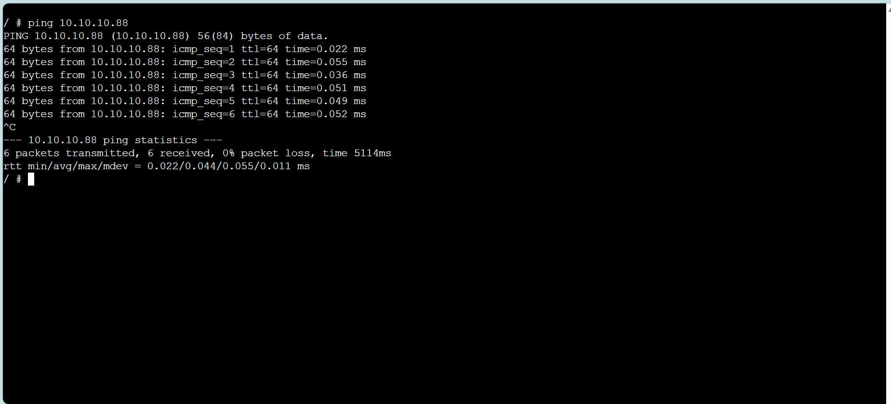

# Task 1: Setting Static IP Addresses

Fig1- Tells about GNS3 setting IP Addresses Project

Fig2- Tells about Network1

Fig3- Tells about Network2

Fig4-Tells about IP address in host1

Fig5-Tells about IP address in host2

Fig6-Tells about IP address in host3

Fig7-Tells about IP address in host4

Fig8-Tells about pig command output1

Fig9-Tells about pig command output2

Fig10-Tells about pig command output3
