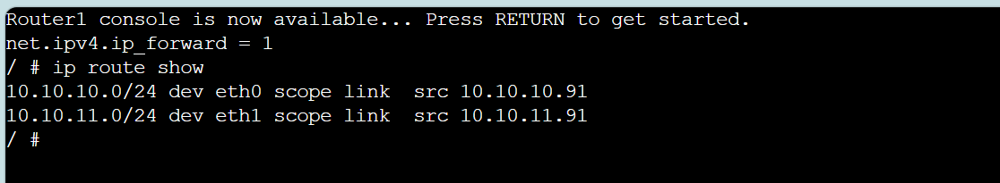
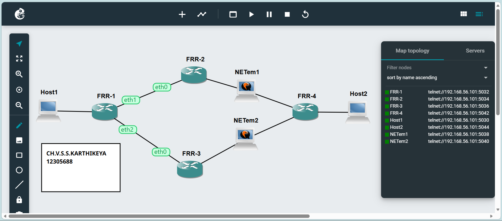

# Task 1: View Routing Tables

Fig1- Explains about View Routes of GNS3 Project

Fig2- Explains Network of host1

Fig3- Explains Network of host3

Fig4- Explains Network of router

Fig5- Explains ping of the routes

# Task2: Dynamic Routing with OSPF

Fig6- Explains about dynamic routing setup and handels of network changes
