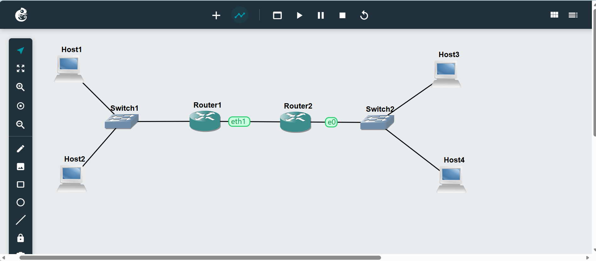
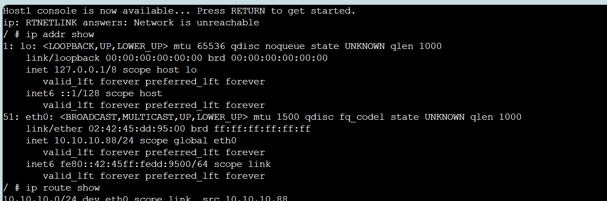
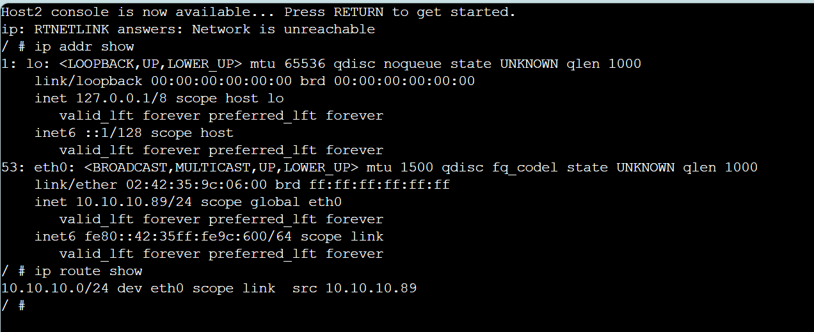
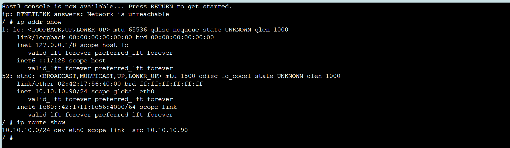
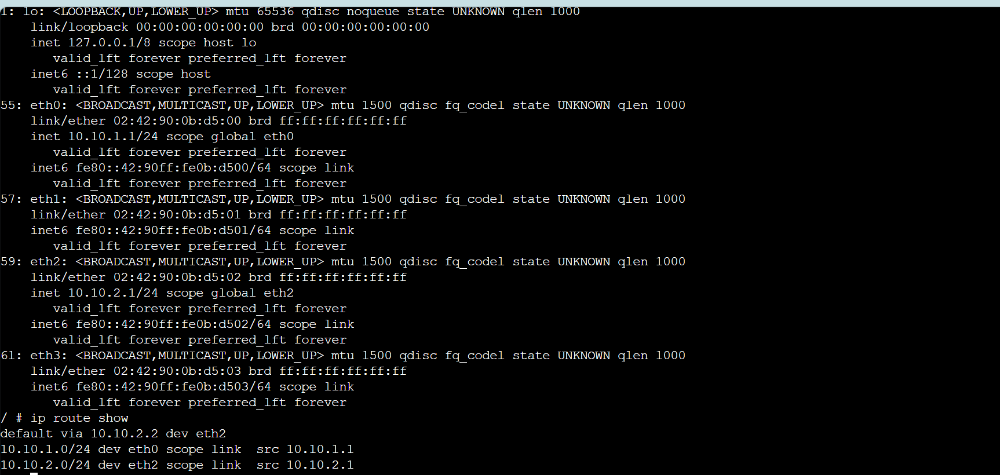
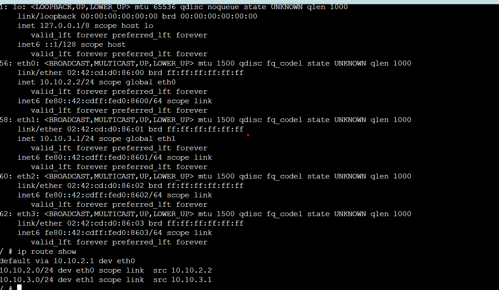
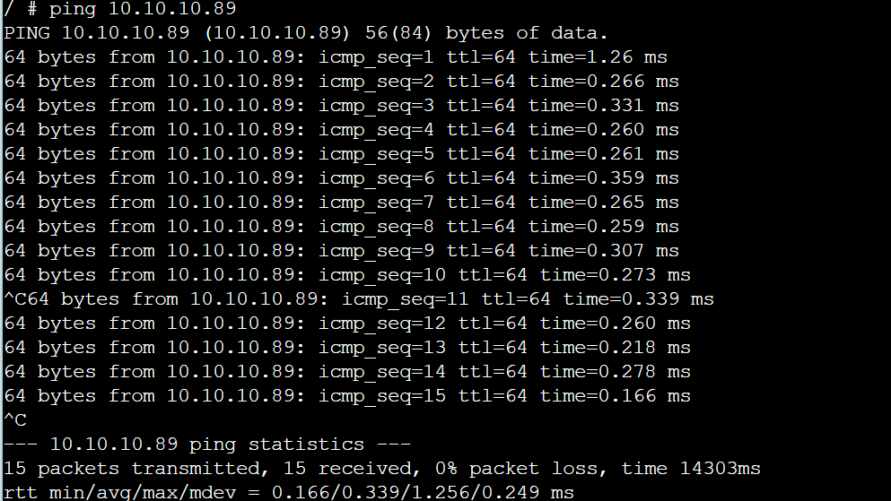

# Task 1: Resolving IP Addresses to Hardware Addresses

Fig1- Explains about ARP tables of host1 at different time points that illustratethe changes in the ARP table as devices communicate.

# Task 2: Default Gateways

Fig2- Explains about the Default Gateway Project

Fig3- explains about ipaddress of host1

Fig4- Explains about ipaddress of host2

Fig5- Explains about ipaddress of host3

Fig6- Explains about ipaddress in router1

Fig7- explains about ipaddress in router2

Fig8- explains about successful ping
